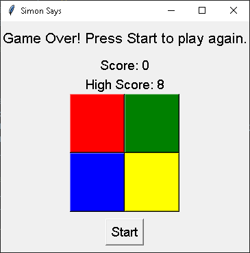

# Python Simon Says Game

## Overview

A modern, interactive implementation of the classic Simon Says memory game, featuring a responsive graphical user interface, dynamic sound effects, and engaging voice guidance.

---

## Key Features

- **Interactive Gameplay**: Responsive GUI with a classic Simon Says game mechanic
- **Dynamic Audio Experience**:
  - Unique tones for each game button
  - Voice-guided color announcements
- **Advanced Game Mechanics**:
  - Comprehensive scoring system
  - Progressive difficulty scaling
  - High score tracking
- **Optimized User Experience**:
  - Clean, automated sound file management
  - Intuitive user interface

---

## Table of Contents
- [Releases](#releases)
- [Prerequisites](#prerequisites)
- [Installation](#installation)
- [Usage](#usage)
- [File Structure](#file-structure)
- [How It Works](#how-it-works)
- [Dependencies](#dependencies)
- [Future Improvements](#future-improvements)
- [Screenshot](#screenshot)
- [Contributing](#contributing)
- [License](#license)
- [Contact](#contact)

---

## Releases

### Latest Release

The latest standalone executable is available for download here:
[**Simon Says v1.0 - Download Standalone Executable**](https://github.com/Cod-e-Codes/python-simon-says/releases/tag/v1.0)

**For Users:**
- Download `main.exe` for Windows from the latest release.
- Run the executable to start playing the game without installing Python or dependencies.

**For Developers:**
- Download the source code from the same release page.
- Follow the installation and usage instructions below to run or modify the project.

---

## Prerequisites

### System Requirements

- **Python Version**: 3.8+ (Tested on 3.12.3)
- **Platform**: Windows, macOS, Linux

### Development Tools

- Python
- pip
- (Recommended) Virtual environment

---

## Installation

### 1. Clone the Repository

```bash
git clone https://github.com/Cod-e-Codes/python-simon-says.git
cd python-simon-says
```

### 2. Set Up Virtual Environment

```bash
# Create virtual environment
python -m venv venv

# Activate virtual environment
# macOS/Linux
source venv/bin/activate

# Windows
.\venv\Scripts\activate
```

### 3. Install Dependencies

```bash
pip install -r requirements.txt
```

---

## Usage

### Prepare Sound Files

```bash
python sound_gen.py
```

This script creates `.wav` files for the game's tones and cleans up temporary voice files after combining them.

### Launch the Game

```bash
python main.py
```

### Standalone Executable

If you downloaded the `main.exe` file, simply double-click to launch the game.

---

## File Structure

```plaintext
python-simon-says/
│
├── main.py              # Primary game implementation
├── sound_gen.py         # Sound generation and management
│
├── *.wav                # Generated sound files
├── requirements.txt     # Project dependencies
├── screenshot.png       # Game interface preview
├── icon.ico             # Application icon
└── README.md            # Project documentation
```

---

## How It Works

### 1. **Sound Generation** (`sound_gen.py`):
- Generates tones for the four colors using `pydub`.
- Leverages `pyttsx3` for voice synthesis.
- Combines tones and voice prompts into `.wav` files.
- Cleans up temporary voice files automatically.

### 2. **Simon Says Game** (`main.py`):
- Tkinter-based graphical interface.
- Dynamic difficulty progression.
- Real-time score tracking.
- High score preservation.

---

## Dependencies

| Library       | Version       | Purpose                        |
|---------------|---------------|--------------------------------|
| comtypes      | >=1.4.8,<2.0  | Windows COM interface          |
| pydub         | >=0.25.1,<1.0 | Audio manipulation             |
| pygame        | >=2.6.1,<3.0  | Audio playback                 |
| pypiwin32     | >=223,<224    | Windows Python extensions      |
| pyttsx3       | >=2.98,<3.0   | Text-to-speech synthesis       |
| pywin32       | >=308,<309    | Windows Python extensions      |

Install them using the provided `requirements.txt` file.

---

## Future Improvements

- [ ] Implement visual button press effects
- [ ] Develop global leaderboard system
- [ ] Create custom sound theme support
- ✅ **Cross-platform packaging solutions** *(Windows supported; planning to expand to macOS and Linux in future releases)

---

## Screenshot



---

## Contributing

Contributions are welcome! Please follow these steps:

1. Fork the repository
2. Create your feature branch (`git checkout -b feature/AmazingFeature`)
3. Commit your changes (`git commit -m 'Add some AmazingFeature'`)
4. Push to the branch (`git push origin feature/AmazingFeature`)
5. Open a Pull Request

---

## License

Distributed under the MIT License. See `LICENSE` for more information.

---

## Contact

Project Link: [https://github.com/Cod-e-Codes/python-simon-says](https://github.com/Cod-e-Codes/python-simon-says)

---

**Enjoy challenging your memory with Python Simon Says!**

